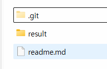

1. `.gitignore` 언제 만들고, 어디에 만들어야 하나요?
  - (깃으로 관리하고 있는) 최상위 폴더에 만들면 된다.
    - `study/.git ` 얘랑 같은 depth에다가 `.gitignore`를 만들면
    - `study/**/**/**/**/venv` <- 위에서 만든 .gitignore에 의해서 무시됨.
  - `study/**/hw_1_4/.git` <- 과제를 처음 진행할땐 폴더가 이렇게 만들어짐.
    - `hw_1_4/` 이 폴더 안에서 git으로 관리하고자 한다면, 이때의 최상위 폴더는 어디가 되느냐?
    - `hw_1_4/` 여기가 최상위폴더가 된다.
      
