# 02-pjt

## 1. 기본(필수) 기능

### A. 데이터베이스 모델링 및 관계 설정
데이터베이스의 기반이 될 각 모델의 필드와 모델 간의 관계를 설정합니다. 이 단계는 API 구현의 가장 기초가 됩니다.

#### < 모델 구축 실행 결과 >
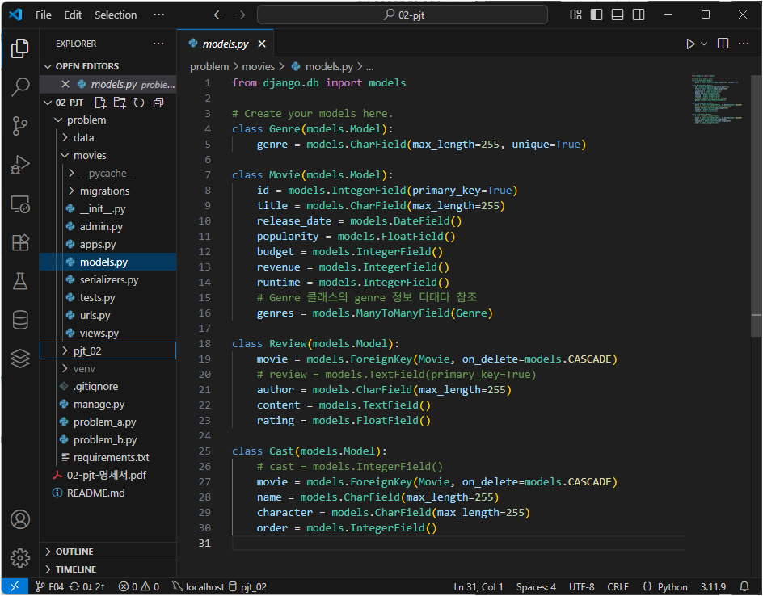

#### < migration 실행 결과 >
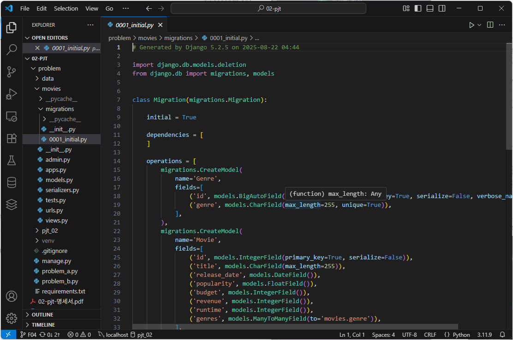

### B. 전체 장르 목록 조회
데이터 조회를 위한 각 GET 엔드포인트를 구현합니다. 각 API는 지정된 형식의 JSON 데이터를 반환해야 합니다.
DB에 저장된 모든 장르의 목록을 반환합니다.

#### < 전체 장르 목록 조회 실행 결과 >
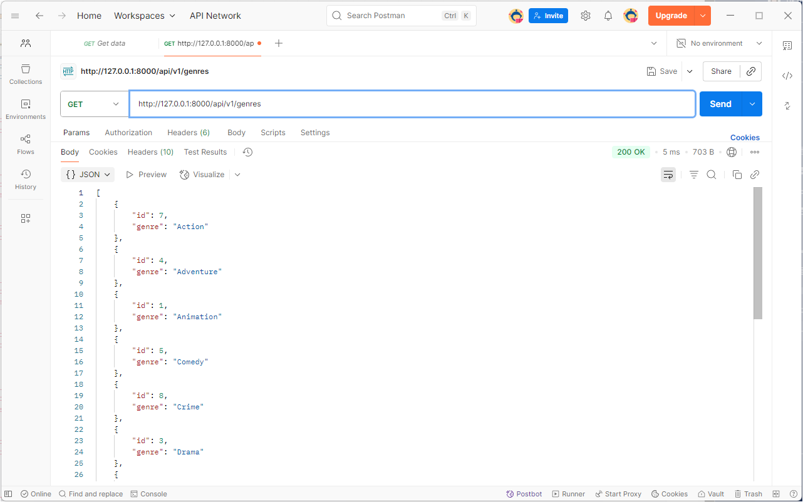

### C. 전체 영화 목록 조회
데이터 조회를 위한 각 GET 엔드포인트를 구현합니다. 각 API는 지정된 형식의 JSON 데이터를 반환해야 합니다.
DB에 저장된 모든 영화의 목록을 반환합니다. 각 영화 객체에는 해당 영화의 장르 id 목록이 포함되어야 합니다.

#### < 전체 영화 목록 조회 실행 결과 >
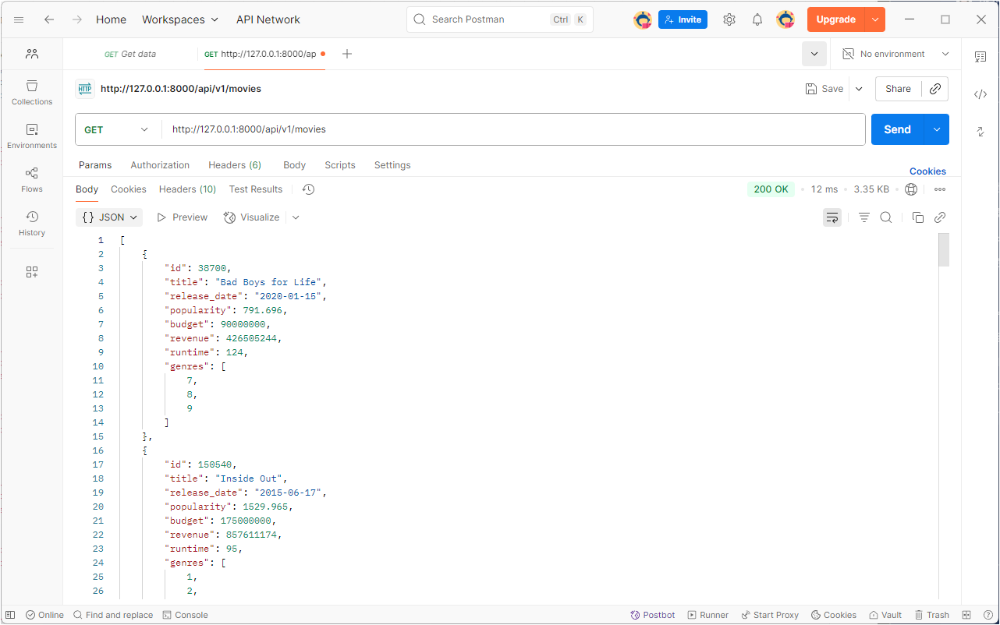

### D. 단일 영화 상세 정보 조회
데이터 조회를 위한 각 GET 엔드포인트를 구현합니다. 각 API는 지정된 형식의 JSON 데이터를 반환해야 합니다.
특정 영화(movie_pk)의 모든 상세 정보와, 해당 영화에 종속된 출연진(cast_set), 리뷰(review_set), 장르(genres) 정보를 함께 반환합니다.

#### < 단일 영화 상세 정보 조회 실행 결과 >
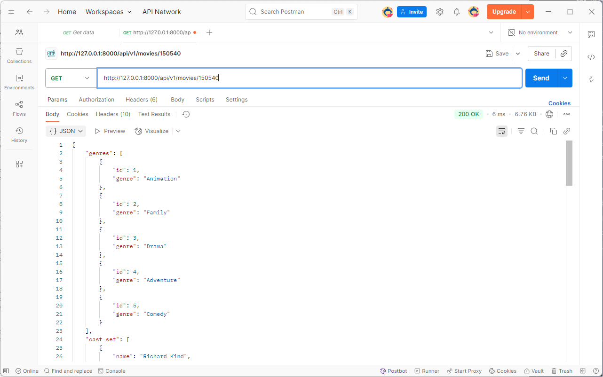

### E. 전체 리뷰 목록 조회
데이터 조회를 위한 각 GET 엔드포인트를 구현합니다. 각 API는 지정된 형식의 JSON 데이터를 반환해야 합니다.
모든 리뷰 목록을 반환합니다. 각 리뷰 객체에는 리뷰가 달린 영화의 id와 title이 포함되어야 합니다.

#### < 전체 리뷰 목록 조회 실행 결과 >
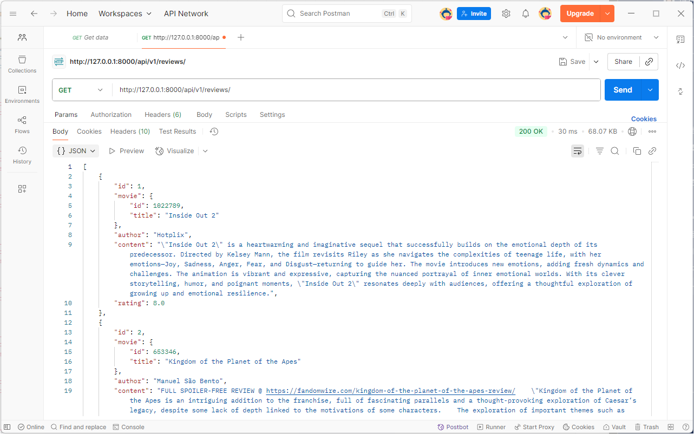

### F. 단일 리뷰 조회/수정/삭제
**[GET]**: 특정 리뷰(review_pk)의 상세 정보를 반환합니다.

#### < GET 실행 결과 >
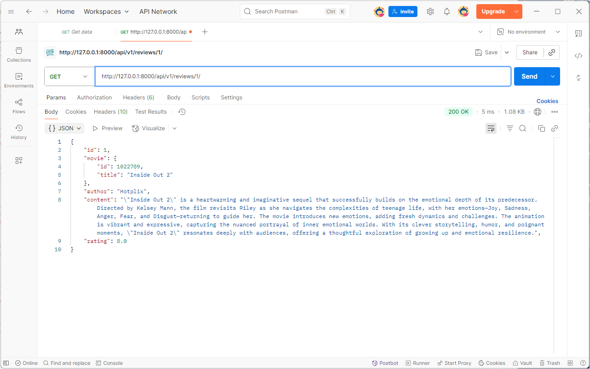

**[PUT]**: 특정 리뷰의 모든 필드(author, content, rating)를 요청받은 값으로 교체합니다. 일부 필드만 보내면 오류가 발생해야 합니다.
#### < PUT 실행 결과 >
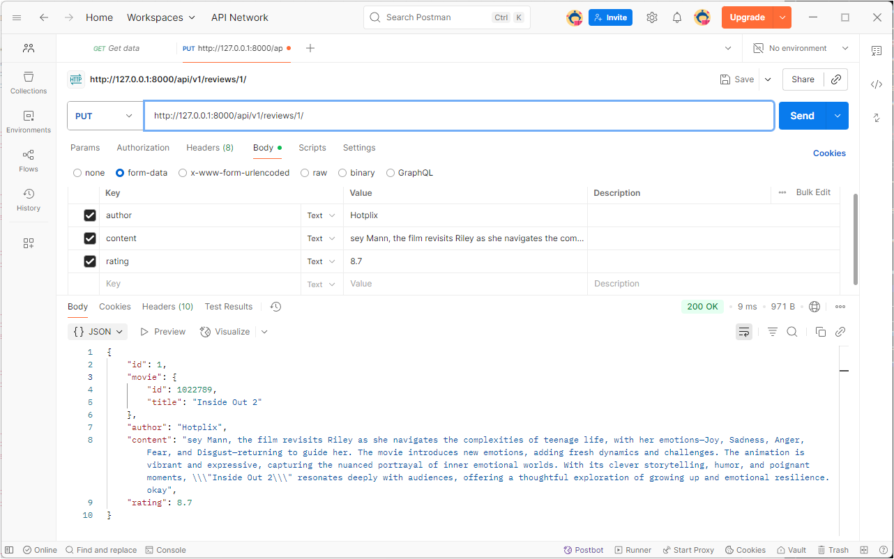

#### < PUT 실행 결과 (값 전체 할애하지 않은 경우) >
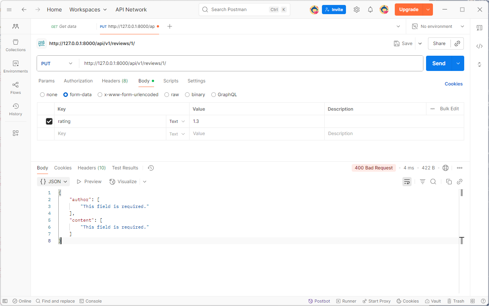

**[PATCH]**: 특정 리뷰의 일부 필드만 요청받은 값으로 수정합니다.
#### < PATCH 실행 결과 >
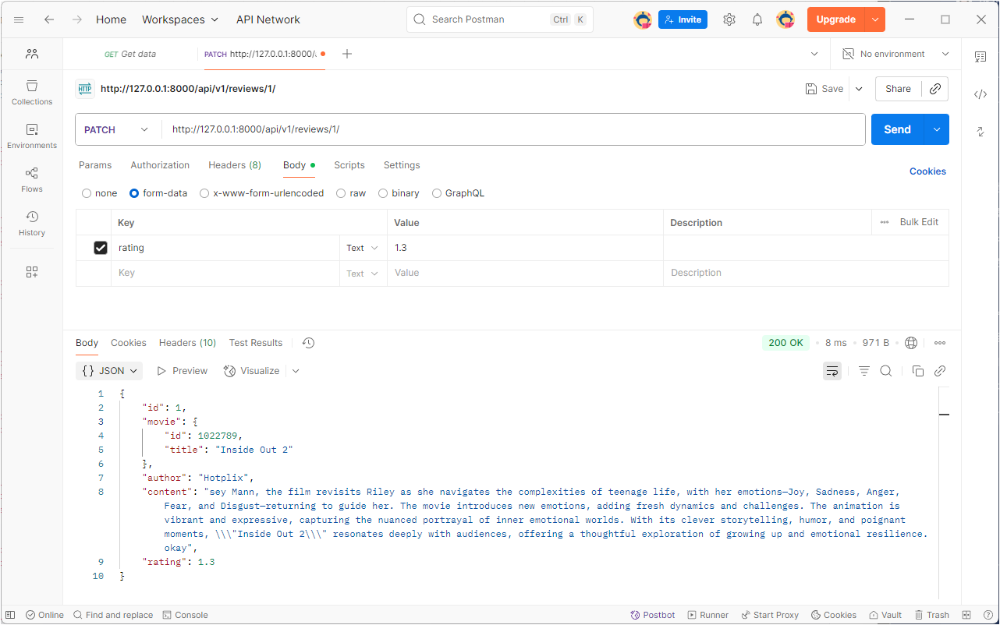

**[DELETE]**: 특정 리뷰를 DB에서 삭제합니다.

#### < DELETE 실행 결과 >
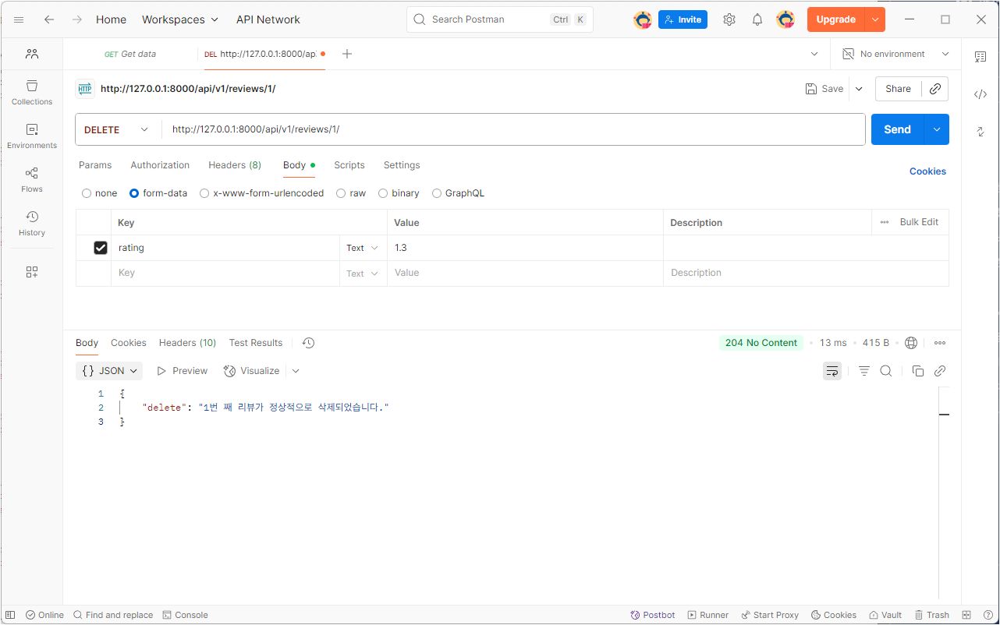

### G. 특정 영화에 대한 리뷰 생성
movie_pk에 해당하는 영화에 새로운 리뷰를 생성합니다.

#### < 특정 영화에 대한 리뷰 생성 실행 결과 >
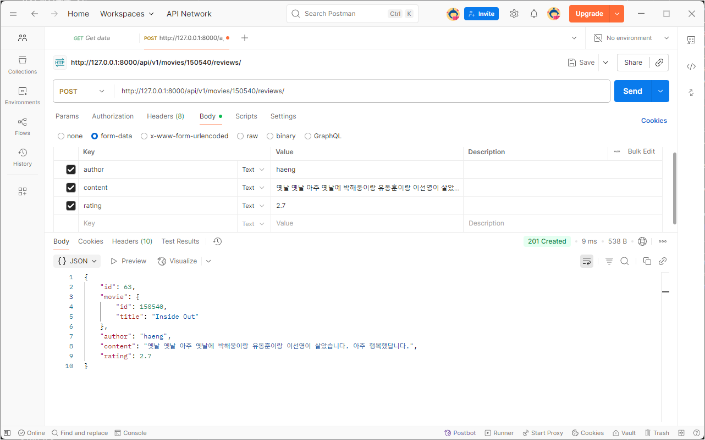

# Trouble shooting

## 1. 데이터 전처리
문제: 하나의 Movie 모델을 완성하는 데 필요한 정보가 movies.csv(기본 정보)와 movie_details.csv(상세 정보) 두 파일에 나뉘어 있었음.

원인: 데이터가 movie_id를 기준으로 정규화되어 여러 파일에 분산 저장. 각 영화 정보를 생성할 때마다 두 파일을 동시에 탐색하는 것은 비효율적이고 복잡한 로직을 요구.

해결: 데이터 삽입 스크립트에서 딕셔너리를 활용한 조회 최적화 방법을 사용. 이 방식을 통해 불필요한 파일 탐색을 제거하고 간결한 코드로 두 데이터를 병합하여 Movie 객체를 생성.

## 2. `ManyToManyField` 관계 데이터 표현
문제: 영화 목록 API 조회 시, genres 필드가 장르의 상세 정보가 아닌 ID 목록([1, 5, 7])으로 출력됨.

원인: DRF는 기본적으로 ManyToManyField 관계를 관련 객체의 PK(ID) 목록으로 직렬화(serialize).

해결: 중첩 Serializer(Nested Serializer) 개념을 적용. 이를 통해 ID 목록 대신 각 장르의 상세 정보(id, name)가 포함된 객체 목록으로 응답 형식을 변경.

## 3. 독립 실행 스크립트의 `ModuleNotFoundError`
문제: 데이터 삽입 스크립트를 manage.py 없이 단독으로 실행하자 ModuleNotFoundError: No module named 'pjt_02' 오류 발생.

원인: 파이썬 인터프리터가 스크립트를 실행할 때, Django 프로젝트(pjt_02)의 위치를 알지 못해 관련 모듈(models 등)을 못 찾음.

해결: 스크립트 상단에 sys 모듈을 사용하여 프로젝트의 루트 디렉토리 경로를 동적으로 파악하고, sys.path에 추가하는 코드를 삽입했습니다. 이로써 스크립트가 어느 위치에서 실행되더라도 Django 프로젝트의 설정과 모델을 정상적으로 불러올 수 있게 됨.